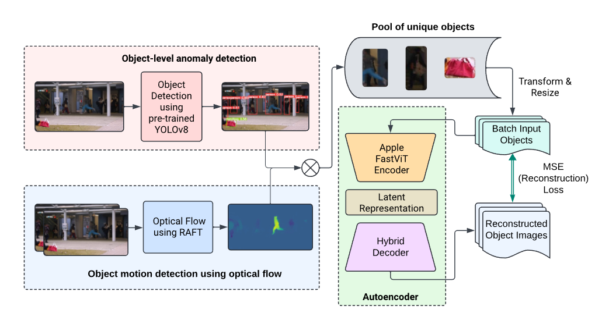

# Anomaly Detection

# Introduction
In this study, we introduce a robust baseline for transformer-based, object-centric anomaly detection in videos, designed to identify and differentiate anomalies in real time. Our approach integrates the use of YOLOv8, a highly efficient and precise object detector, alongside RAFT, a state-of-the-art optical flow model that produces motion gradients for consecutive frames. Experiments were conducted on three prominent benchmarks: Avenue, ShanghaiTech, and UBNormal. Our findings indicate that this baseline method is competitive with existing frame-level approaches in terms of detection accuracy, while also demonstrating superior efficiency compared to other object-centric methods. However, there is still potential for improvement in micro and macro AUC metrics in order to be considered state-of-the-art. Additionally, we performed extensive ablation studies to validate the efficacy of our architectural design choices.



In the above image, we propose a framework for detecting anomalies using self-supervised learning. Objects are originally detected using the YOLOv8 object detector. Concurrently, optical flow will be applied through the use of RAFT. Objects detected in images will be cropped, resized, and fed to our autoencoder for a reconstruction-based anomaly detection approach.

# Datasets
We evaluated the effectiveness of our video anomaly detection method across three datasets: Avenue, ShanghaiTech, and UBnormal.

- **Avenue Dataset**: Comprising 16 training videos and 21 test videos, Avenue includes 30,652 frames in total, with anomalies such as running, throwing objects, or moving against traffic. The resolution is 360 × 640 pixels.

- **ShanghaiTech Dataset**: The largest dataset with 330 training videos and 107 test videos, totaling approximately 320,000 frames. Anomalies include theft, physical altercations, and inappropriate use of bicycles. The resolution is 480 × 856 pixels.

- **UBnormal Dataset**: Featuring around 209,000 frames, UBnormal uses an open set evaluation with synthetic data created from video game characters, allowing for diverse anomalies and controlled testing conditions.

These datasets provided a comprehensive evaluation framework for our anomaly detection method, covering a range of scenarios and anomaly types.

# Results

Our recent evaluation of anomaly detection methods across several benchmark datasets, including Avenue, ShanghaiTech, and UBnormal, shows competitive performance for our approach, balancing accuracy and computational efficiency, evident from the frames per second (FPS) metrics.

**Avenue Dataset**:
- Achieved a Micro AUC of 86.7% and a Macro AUC of 84.6%, surpassing several newer frame-level methods.
- Demonstrated robustness in handling context-dependent anomalies.
- However, it falls short of the 90%+ Macro AUCs achieved by object-centric methods.

**ShanghaiTech Dataset**:
- Achieved a Micro AUC of 76.9% and a Macro AUC of 82.6%.
- Notably outperforms many recent publications despite the dataset's complexity.

**UBnormal Dataset**:
- Achieved a Micro AUC of 56.6% and a Macro AUC of 73.6%.
- Performance aligns with other papers, reflecting the dataset's diversity and situational complexity.

**Computational Efficiency**:
- Our method operates at a higher FPS compared to object-centric methods, advantageous for real-time applications.
- FPS is limited by RAFT’s speed (40 FPS on an Nvidia RTX 3090). Without RAFT, a slight 1-2% decrease in AUC scores on Avenue is observed.

Our method demonstrates a strong balance between performance and computational efficiency, making it suitable for real-time applications, with potential for further improvements through techniques like adversarial training, knowledge distillation, and latent representation clustering.


# Project Setup
## 1. Locally installing dependencies

### 1.1. Create Virtual Environment within Linux (or WSL) using these commands (more or less, depending on what you already have installed)
```bash
sudo apt update && sudo apt upgrade -y
sudo apt install software-properties-common -y
sudo add-apt-repository ppa:deadsnakes/ppa
sudo apt install python3.10
sudo apt install python3-pip python3.10-venv

python3 -m venv /path/to/new/virtual/environment
python3.10 -m venv myenv
source myenv/bin/activate
```

### 1.2. Also make sure to install other potentially relevant packages after activating current environment.
```py
pip3 install wheel jupyter
pip3 install --upgrade pip setuptools wheel
```

### 1.3. Now's the shaky part - we want to install a very specific Cuda Toolkit version, with a very specific PyTorch version. This can cause headaches - and a lot of frustration. We want to install cuda toolkit 11.6 with PyTorch version 1.13. As such, assuming we are using Ubuntu 20.04, we'll want to run something along the lines of:
```bash
# CUDA installation on Ubuntu - https://gist.github.com/ksopyla/bf74e8ce2683460d8de6e0dc389fc7f5
#############
wget https://developer.download.nvidia.com/compute/cuda/repos/ubuntu2004/x86_64/cuda-ubuntu2004.pin
sudo mv cuda-ubuntu2004.pin /etc/apt/preferences.d/cuda-repository-pin-600

# new key, added 2022-04-25 22:52
sudo apt-key adv --fetch-keys https://developer.download.nvidia.com/compute/cuda/repos/ubuntu2004/x86_64/3bf863cc.pub

sudo add-apt-repository "deb http://developer.download.nvidia.com/compute/cuda/repos/ubuntu2004/x86_64/ /"
############

# The more important commands
sudo apt update
sudo apt install cuda-toolkit-11-6

# PyTorch installation with CUDA 11.6
pip install torch==1.13.0+cu116 torchvision==0.14.0+cu116 torchaudio==0.13.0 --extra-index-url https://download.pytorch.org/whl/cu116
```

New versions of cuda toolkit should work, but there might be issues when installing specific PyTorch versions.

## 2. Clone FastViT (Apple Research)
Clone the [`ml-fastvit`](https://github.com/apple/ml-fastvit) repo into the root of this repo:
```
git clone git@github.com:apple/ml-fastvit.git
```
We will leverage the code from here later by appending this folder to our Python packages path.

## 3. Clone RAFT (Optical Flow)
Clone the [`RAFT`](https://github.com/princeton-vl/RAFT) repo into the root of this repo:
```
git clone git@github.com:princeton-vl/RAFT.git
```

## 4. Final Touches
- Notebooks are expected to run from the root of the repository. Copy them if necessary
- The following code contained a `datasets` folder which contained all 3 datasets, and as such, many of the paths used within the code take this into account.

